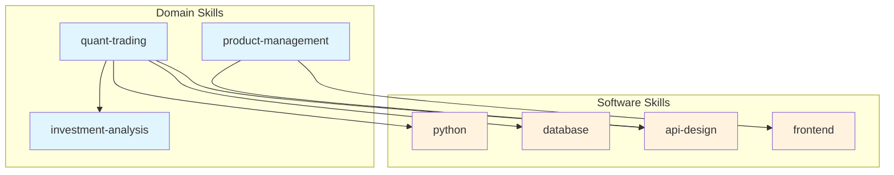

# 生態系統智能化實施規劃

> 基於 7 個協同發現 + 15 個組合食譜 + 10 個改進方向的完整路線圖

## 規劃總覽

```
┌─────────────────────────────────────────────────────────────────────────┐
│                         實施路線圖                                       │
│                                                                         │
│  Phase 1          Phase 2          Phase 3          Phase 4            │
│  基礎建設          功能增強          智能進化          生態完善          │
│  (1-2 週)          (2-4 週)          (4-6 週)          (6-8 週)         │
│                                                                         │
│  ┌─────────┐      ┌─────────┐      ┌─────────┐      ┌─────────┐       │
│  │跨域依賴 │  →   │涌現追蹤 │  →   │知識蒸餾 │  →   │健康儀表板│       │
│  │Recipes │      │智能路由 │      │漸進揭示 │      │版本協調 │       │
│  │接口層  │      │情境描述 │      │遺忘曲線 │      │生態圖譜 │       │
│  └─────────┘      └─────────┘      └─────────┘      └─────────┘       │
│                                                                         │
│  專案影響：                                                              │
│  ■ skillpkg  ■ self-evolving-agent  ■ domain-skills                    │
│  ■ software-skills  ■ starter-kit  □ 新專案 (skill-recipes)            │
└─────────────────────────────────────────────────────────────────────────┘
```

---

## Phase 1: 基礎建設 (Week 1-2)

> 目標：建立跨領域連結的基礎設施

### 1.1 跨領域依賴聲明 [Discovery #1]

**影響專案**: claude-domain-skills, skillpkg

**任務清單**:

| # | 任務 | 專案 | 檔案 |
|---|------|------|------|
| 1.1.1 | 擴展 SKILL.md schema 支援 `software-skills` 依賴 | skillpkg | `packages/core/src/parser/schema.ts` |
| 1.1.2 | 更新 DependencyResolver 處理跨類型依賴 | skillpkg | `packages/core/src/resolver/` |
| 1.1.3 | 為 quant-trading 添加依賴聲明 | domain-skills | `finance/quant-trading/SKILL.md` |
| 1.1.4 | 為 investment-analysis 添加依賴聲明 | domain-skills | `finance/investment-analysis/SKILL.md` |
| 1.1.5 | 為 game-design 添加依賴聲明 | domain-skills | `creative/game-design/SKILL.md` |
| 1.1.6 | 為其他 domain skills 添加依賴 (批量) | domain-skills | 多個檔案 |
| 1.1.7 | 更新 skillpkg 文檔說明新依賴類型 | skillpkg | `README.md` |
| 1.1.8 | 撰寫整合測試驗證跨域依賴解析 | skillpkg | `packages/core/src/resolver/__tests__/` |

**依賴聲明範例**:
```yaml
# finance/quant-trading/SKILL.md
---
name: quant-trading
version: 1.1.0
dependencies:
  skills:           # 同類型依賴 (domain)
    - investment-analysis
  software-skills:  # 跨類型依賴 (新增)
    - python
    - database
    - api-design
    - testing-strategies
---
```

**驗收標準**:
- [ ] `skillpkg install quant-trading` 自動安裝 python, database 等軟體技能
- [ ] 所有 20 個 domain skills 都有適當的軟體技能依賴
- [ ] 測試覆蓋率 > 80%

---

### 1.2 動態 Skill 匹配引擎 [Discovery #5]

**影響專案**: skillpkg, self-evolving-agent

**核心理念**: 不需要預設 Recipe 文件，系統根據用戶目標**動態分析**並推薦 skill 組合。

**核心工作流程 (Goal → Analyze → Recommend → Confirm/Change/Customize)**:
```
┌─────────────────────────────────────────────────────────────────┐
│  動態 Skill 推薦流程 v3.0                                       │
│                                                                 │
│  1. 用戶輸入目標                                                │
│     例：「建立一個量化交易回測系統」                            │
│                                                                 │
│  2. Skill 匹配引擎分析                                          │
│     ┌───────────────────────────────────────────────────────┐  │
│     │  關鍵詞提取：                                          │  │
│     │    - 量化交易 → quant-trading (domain)                │  │
│     │    - 回測 → testing-strategies (software)             │  │
│     │    - 系統 → python, database (software)               │  │
│     │                                                        │  │
│     │  依賴分析：                                            │  │
│     │    - quant-trading 依賴 investment-analysis           │  │
│     │    - quant-trading 依賴 python, database              │  │
│     └───────────────────────────────────────────────────────┘  │
│                                                                 │
│  3. 動態生成推薦                                                │
│     ┌─────────────────────────────────────────────────────┐    │
│     │  🎯 分析您的目標後，推薦以下 skills：                │    │
│     │                                                       │    │
│     │  📦 Domain Skills (2):                               │    │
│     │     ✓ quant-trading                                  │    │
│     │     ✓ investment-analysis                            │    │
│     │                                                       │    │
│     │  🔧 Software Skills (4):                             │    │
│     │     ✓ python                                         │    │
│     │     ✓ database                                       │    │
│     │     ✓ api-design                                     │    │
│     │     ○ testing-strategies (建議)                      │    │
│     │                                                       │    │
│     │  選擇：                                               │    │
│     │  [1] ✅ 確認使用推薦組合                             │    │
│     │  [2] ✏️ 自訂（增加或移除 skills）                    │    │
│     │  [3] ⏭️ 跳過，不使用推薦                             │    │
│     └─────────────────────────────────────────────────────┘    │
│                                                                 │
│  4. 根據選擇執行                                                │
│     - 確認 → 自動安裝所有 skills                                │
│     - 自訂 → 顯示完整 skill 清單，可勾選                        │
│     - 跳過 → 繼續執行，手動處理 skill 需求                      │
└─────────────────────────────────────────────────────────────────┘
```

**任務清單**:

| # | 任務 | 專案 | 檔案 |
|---|------|------|------|
| 1.2.1 | 設計 Skill 關鍵詞索引格式（為每個 skill 定義 triggers/keywords） | skillpkg | `packages/core/src/matching/` |
| 1.2.2 | 實現 Skill 匹配引擎（目標文字 → 關鍵詞提取 → skill 匹配） | skillpkg | `packages/core/src/matching/engine.ts` |
| 1.2.3 | 整合跨域依賴解析（找到 domain skill 後自動包含依賴的 software skills） | skillpkg | `packages/core/src/resolver/` |
| 1.2.4 | 實現 recommend_skills MCP tool（返回動態組合建議） | skillpkg | `packages/mcp-server/src/tools/` |
| 1.2.5 | 在 evolving-agent Phase 1 整合動態推薦 | evolving-agent | `SKILL.md` Phase 1 |

**Skill 關鍵詞索引格式**:
```yaml
# 在每個 SKILL.md 的 frontmatter 中新增
---
name: quant-trading
triggers:
  keywords:
    primary: [量化, quant, 交易, trading, 回測, backtest, 策略]
    secondary: [股票, 期貨, algo, 自動交易]
  context_boost: [Python, 資料分析, 金融, finance]
  context_penalty: [行銷, marketing, 設計, design]
  priority: high  # 當多個 skills 匹配時的優先級
---
```

**匹配引擎邏輯**:
```typescript
// recommend_skills MCP tool 核心邏輯
interface SkillRecommendation {
  domain_skills: { name: string; confidence: number; reason: string }[];
  software_skills: { name: string; confidence: number; reason: string }[];
  from_dependencies: string[];  // 從依賴解析自動加入的
}

function recommendSkills(goal: string): SkillRecommendation {
  // 1. 提取關鍵詞
  const keywords = extractKeywords(goal);

  // 2. 匹配 domain skills（優先）
  const domainMatches = matchSkills(keywords, domainSkillIndex);

  // 3. 匹配 software skills
  const softwareMatches = matchSkills(keywords, softwareSkillIndex);

  // 4. 解析依賴（domain → software）
  const dependencies = resolveDependencies(domainMatches);

  // 5. 合併並去重
  return {
    domain_skills: domainMatches,
    software_skills: [...softwareMatches, ...dependencies],
    from_dependencies: dependencies.map(d => d.name)
  };
}
```

**研究模式 (Research Mode)**:

當匹配引擎找不到足夠的 skills 時，自動進入研究模式：

```
┌─────────────────────────────────────────────────────────────────┐
│  研究模式觸發條件                                               │
│                                                                 │
│  • 匹配信心分數 < 0.5                                           │
│  • 找到的 skills 數量 < 2                                       │
│  • 目標包含未知領域關鍵詞                                       │
│                                                                 │
│  研究模式流程：                                                 │
│  ┌─────────────────────────────────────────────────────────┐   │
│  │  🔬 進入研究模式                                         │   │
│  │                                                          │   │
│  │  您的目標：「建立一個 AR 眼鏡應用」                       │   │
│  │                                                          │   │
│  │  ⚠️ 現有 skills 匹配度較低：                             │   │
│  │     • 無 AR/VR 相關 domain skill                        │   │
│  │     • 部分 software skills 可能適用                      │   │
│  │                                                          │   │
│  │  建議行動：                                              │   │
│  │  [1] 🔍 搜尋相關 skills（從 GitHub/Registry）            │   │
│  │  [2] 📚 使用現有 skills + 額外研究                       │   │
│  │  [3] 🛠️ 繼續執行（手動處理知識缺口）                     │   │
│  └─────────────────────────────────────────────────────────┘   │
│                                                                 │
│  如果選擇 [1]：                                                 │
│  → 呼叫 search_skills MCP tool 搜尋外部 skills                 │
│  → 找到後建議安裝，然後回到正常流程                            │
│                                                                 │
│  如果選擇 [2]：                                                 │
│  → 安裝最相關的現有 skills                                     │
│  → 在 evolving-agent Phase 3 時進行額外 WebSearch              │
│  → 將新學到的知識記錄到 .claude/memory/learnings/              │
└─────────────────────────────────────────────────────────────────┘
```

**驗收標準**:
- [ ] recommend_skills MCP tool 可根據任意目標文字推薦 skills
- [ ] 推薦結果包含信心分數和推薦原因
- [ ] 自動解析並包含 domain skill 的 software 依賴
- [ ] 匹配度低時自動觸發研究模式
- [ ] 用戶可選擇「確認/自訂/跳過/研究」
- [ ] 所有 69 個現有 skills 都有 triggers 關鍵詞定義

---

### 1.3 Domain-Software 接口層 [Insight #7]

**影響專案**: 新目錄 in domain-skills

**任務清單**:

| # | 任務 | 專案 | 檔案 |
|---|------|------|------|
| 1.3.1 | 建立 interfaces/ 目錄結構 | domain-skills | `interfaces/` |
| 1.3.2 | 建立 Finance → Tech 接口 | domain-skills | `interfaces/finance-to-tech.md` |
| 1.3.3 | 建立 Business → Tech 接口 | domain-skills | `interfaces/business-to-tech.md` |
| 1.3.4 | 建立 Creative → Tech 接口 | domain-skills | `interfaces/creative-to-tech.md` |
| 1.3.5 | 在 self-evolving-agent 整合接口查詢 | evolving-agent | `SKILL.md` Phase 1.5 |

**接口文件範例**:
```markdown
# Finance → Tech 接口映射

## 需求到技術的映射

| 領域需求 | 技術實現 | 軟體技能 |
|---------|---------|---------|
| 財務資料分析 | Python + Pandas | python, database |
| 即時行情處理 | WebSocket + 時序DB | realtime-systems, database |
| 報告生成 | React + Chart.js | frontend, data-design |
| 策略回測 | Backtrader/Zipline | python, testing-strategies |
| 風險計算 | NumPy/SciPy | python, performance-optimization |

## 常見組合模式

### 模式 1: 研究型量化
- Domain: investment-analysis (深度) + quant-trading (基礎)
- Software: python + database + jupyter

### 模式 2: 生產型量化
- Domain: quant-trading (深度) + investment-analysis (基礎)
- Software: python + database + api-design + devops-cicd
```

---

### Phase 1 Milestone

```
□ 1.1 跨領域依賴: skillpkg 支援 software-skills 依賴
□ 1.2 動態匹配: recommend_skills MCP tool 可根據目標推薦 skills
□ 1.3 接口層: 3 個主要領域的接口映射
□ 文檔: 所有新功能有對應文檔
□ 測試: 核心功能測試覆蓋
```

---

## Phase 2: 功能增強

> 目標：提升系統智能化程度

### 2.1 涌現追蹤機制 [Discovery #2]

**影響專案**: self-evolving-agent, starter-kit

**任務清單**:

| # | 任務 | 專案 | 檔案 |
|---|------|------|------|
| 2.1.1 | 設計 skill-metrics 資料結構 | evolving-agent | `docs/skill-metrics-spec.md` |
| 2.1.2 | 在 PDCA Check 階段添加組合記錄 | evolving-agent | `SKILL.md` Phase 2 |
| 2.1.3 | 建立 skill-metrics/ 目錄模板 | starter-kit | `.claude/memory/skill-metrics/` |
| 2.1.4 | 實現組合成功率統計 | evolving-agent | `SKILL.md` Phase 4 |
| 2.1.5 | 添加「推薦類似成功組合」功能 | evolving-agent | `SKILL.md` Phase 1.5 |

**skill-metrics 資料結構**:
```yaml
# .claude/memory/skill-metrics/combinations/2025-01.yaml
combinations:
  - id: "combo-001"
    date: "2025-01-07"
    task: "建立量化回測系統"
    skills_used:
      domain: [quant-trading, investment-analysis]
      software: [python, database, testing-strategies]
    success: true
    iterations: 3
    duration_minutes: 45

  - id: "combo-002"
    date: "2025-01-08"
    task: "開發電商購物車"
    skills_used:
      domain: [sales]
      software: [frontend, backend, database, e-commerce]
    success: true
    iterations: 2

# 統計摘要 (自動生成)
summary:
  total_combinations: 24
  success_rate: 0.87
  most_effective:
    - [python, database, api-design]  # 92% 成功
    - [frontend, backend, testing-strategies]  # 89% 成功
  avg_iterations: 2.8
```

---

### 2.2 智能路由與碰撞偵測 [Discovery #4]

**影響專案**: self-evolving-agent, skillpkg

**任務清單**:

| # | 任務 | 專案 | 檔案 |
|---|------|------|------|
| 2.2.1 | 設計 trigger 優先級機制 | skillpkg | `packages/core/src/discovery/` |
| 2.2.2 | 實現上下文感知路由 | evolving-agent | `SKILL.md` auto-domain-detection |
| 2.2.3 | 添加 trigger 碰撞警告 | skillpkg | `packages/cli/src/commands/` |
| 2.2.4 | 建立 trigger 優先級配置格式 | domain-skills + software-skills | SKILL.md frontmatter |

**優先級配置範例**:
```yaml
# api-design/SKILL.md (software)
triggers:
  - pattern: "API"
    priority: high
    context_boost: ["設計", "開發", "REST", "GraphQL"]  # 共現時優先
    context_penalty: ["行銷", "推廣", "銷售"]  # 共現時降權

# marketing/SKILL.md (domain)
triggers:
  - pattern: "API"
    priority: medium
    context_boost: ["行銷", "推廣", "partner"]
    context_penalty: ["開發", "coding", "REST"]
```

**路由決策邏輯**:
```
輸入: "設計一個支付 API"
關鍵詞: [設計, 支付, API]

候選評分:
1. api-design (software)
   - base: 0.5 (API 匹配)
   - boost: +0.3 (設計 共現)
   - score: 0.8

2. e-commerce (software)
   - base: 0.4 (支付 匹配)
   - score: 0.4

3. marketing (domain)
   - base: 0.3 (API 匹配)
   - penalty: -0.2 (設計 共現 → 技術傾向)
   - score: 0.1

決策: 載入 api-design + e-commerce
```

---

### 2.3 MCP 工具情境描述 [Insight #6]

**影響專案**: skillpkg

**任務清單**:

| # | 任務 | 專案 | 檔案 |
|---|------|------|------|
| 2.3.1 | 重構所有 MCP tool descriptions | skillpkg | `packages/mcp-server/src/tools/` |
| 2.3.2 | 添加 use_when/avoid_when 欄位 | skillpkg | 每個 tool handler |
| 2.3.3 | 更新 MCP server 文檔 | skillpkg | `packages/mcp-server/README.md` |

**情境描述範例**:
```typescript
// install_skill tool
{
  name: "install_skill",
  description: "Install a skill from GitHub, registry, or local path",

  // 新增：情境指引
  use_when: [
    "用戶說「我不會 X」或「我需要學習 Y」",
    "Phase 1.5 檢測到能力缺口",
    "recommend_skill 返回了適合的技能",
    "任務需要特定領域知識但未安裝"
  ],
  avoid_when: [
    "技能已經安裝（先用 list_skills 檢查）",
    "用戶明確說不需要新技能",
    "只是查詢資訊，不需要實際安裝"
  ],

  inputSchema: { /* ... */ }
}
```

---

### 2.4 Starter Kit 動態推薦整合

**影響專案**: starter-kit

**任務清單**:

| # | 任務 | 專案 | 檔案 | 預估 |
|---|------|------|------|------|
| 2.4.1 | CLI 新增「根據目標推薦」選項 | starter-kit | `cli/src/commands/init.ts` | 2h |
| 2.4.2 | 整合 recommend_skills MCP tool | starter-kit | `cli/src/commands/init.ts` | 2h |
| 2.4.3 | 添加推薦結果預覽與確認流程 | starter-kit | `cli/src/commands/init.ts` | 1h |

**CLI 流程更新**:
```
npx claude-starter-kit init

? 選擇初始化類型:
  ○ 空白專案
  ○ 選擇專業領域
  ● 描述您的目標（智能推薦）  ← 新增

? 請描述您想要建立的專案:
> 建立一個量化交易回測系統

🔍 分析中...

? 根據您的目標，推薦以下 skills:

  📦 Domain Skills:
     ✓ quant-trading
     ✓ investment-analysis

  🔧 Software Skills:
     ✓ python (依賴)
     ✓ database (依賴)
     ✓ api-design (推薦)
     ○ testing-strategies (建議)

  [Y] 確認安裝  [C] 自訂  [N] 跳過

正在安裝 6 個 skills...
✓ 安裝完成！
```

---

### Phase 2 里程碑檢查

```
□ 2.1 涌現追蹤: skill-metrics 記錄功能完成
□ 2.2 智能路由: trigger 碰撞偵測與優先級
□ 2.3 情境描述: MCP tools 有完整的 use_when
□ 2.4 動態推薦: starter-kit CLI 支援目標分析推薦
□ 整合測試: 端對端流程測試
```

**預估總時間**: 32-40 小時 (2 週)

---

## Phase 3: 智能進化 (Week 5-6)

> 目標：實現真正的自我進化能力

### 3.1 知識蒸餾管道 [Discovery #3]

**影響專案**: self-evolving-agent, skillpkg

**任務清單**:

| # | 任務 | 專案 | 檔案 | 預估 |
|---|------|------|------|------|
| 3.1.1 | 設計蒸餾觸發條件 | evolving-agent | `docs/knowledge-distillation.md` | 2h |
| 3.1.2 | 實現 learnings 模式偵測 | evolving-agent | `SKILL.md` Phase 4.5 | 4h |
| 3.1.3 | 建立 skill 提案生成邏輯 | evolving-agent | `SKILL.md` | 4h |
| 3.1.4 | skillpkg 新增 create_skill_from_pattern MCP tool | skillpkg | `packages/mcp-server/` | 3h |
| 3.1.5 | 實現用戶確認流程 | evolving-agent | `SKILL.md` | 2h |

**蒸餾流程設計**:
```
┌────────────────────────────────────────────────────────────────┐
│                     知識蒸餾管道                                │
│                                                                │
│  Phase 4.5: Memory 生命週期                                    │
│                                                                │
│  ┌─────────────┐                                              │
│  │ learnings/  │  3+ 筆相似主題                                │
│  │ (原始經驗)  │────────────────┐                             │
│  └─────────────┘                │                             │
│                                  ▼                             │
│                        ┌─────────────────┐                    │
│                        │  模式偵測       │                    │
│                        │  (Grep + 分析)  │                    │
│                        └────────┬────────┘                    │
│                                 │                              │
│                        發現重複模式？                          │
│                        ┌───────┴───────┐                      │
│                        │               │                      │
│                       Yes             No                      │
│                        │               │                      │
│                        ▼               └─→ 繼續累積           │
│               ┌─────────────────┐                             │
│               │  生成 Skill 提案 │                            │
│               │  (結構化模板)    │                            │
│               └────────┬────────┘                             │
│                        │                                      │
│                        ▼                                      │
│               ┌─────────────────┐                             │
│               │  用戶確認       │                             │
│               │  「要生成嗎？」 │                             │
│               └────────┬────────┘                             │
│                        │                                      │
│                       Yes                                     │
│                        │                                      │
│                        ▼                                      │
│               ┌─────────────────┐                             │
│               │ create_skill    │                             │
│               │ (skillpkg MCP)  │                             │
│               └─────────────────┘                             │
│                                                                │
└────────────────────────────────────────────────────────────────┘
```

**提案範例**:
```
📝 發現可蒸餾的知識模式

在 .claude/memory/learnings/ 中找到 5 筆關於「React 效能優化」的記錄:
- 2025-01-03-react-memo.md
- 2025-01-05-usememo-hook.md
- 2025-01-07-virtualization.md
- 2025-01-08-lazy-loading.md
- 2025-01-10-profiler.md

建議生成新 Skill:

名稱: react-performance-patterns
描述: React 效能優化的完整模式集合
內容:
  - useMemo/useCallback 使用時機
  - 列表虛擬化技巧
  - 懶加載策略
  - Profiler 使用方法

要生成這個 Skill 嗎？[Y/n/e(edit)]
```

---

### 3.2 Skill 漸進式揭示 [Insight #4]

**影響專案**: skillpkg, self-evolving-agent

**任務清單**:

| # | 任務 | 專案 | 檔案 | 預估 |
|---|------|------|------|------|
| 3.2.1 | 設計 layer 標記格式 | skillpkg | `docs/progressive-disclosure.md` | 2h |
| 3.2.2 | 實現 layer 解析器 | skillpkg | `packages/core/src/parser/` | 3h |
| 3.2.3 | 更新 load_skill MCP tool 支援 layer 參數 | skillpkg | `packages/mcp-server/` | 2h |
| 3.2.4 | 在 evolving-agent 實現複雜度評估 | evolving-agent | `SKILL.md` Phase 1 | 3h |
| 3.2.5 | 為 5 個大型 skills 添加 layer 標記 | domain + software | 多個 SKILL.md | 4h |

**Layer 格式設計**:
```yaml
# investment-analysis/SKILL.md
---
name: investment-analysis
layers:
  core:
    lines: "1-80"
    token_estimate: 2000
    includes: ["概述", "基本概念", "快速參考"]

  intermediate:
    lines: "81-250"
    token_estimate: 5000
    includes: ["分析框架", "常用指標", "最佳實踐"]

  advanced:
    lines: "251-503"
    token_estimate: 8000
    includes: ["進階估值", "特殊情況", "深度案例"]
---
```

**載入邏輯**:
```typescript
// load_skill MCP tool 更新
interface LoadSkillParams {
  id: string;
  layer?: "core" | "intermediate" | "full";  // 新增
  auto_detect?: boolean;  // 根據任務複雜度自動選擇
}

// 自動偵測邏輯
function detectRequiredLayer(task: string, skill: Skill): Layer {
  const complexity = assessTaskComplexity(task);

  if (complexity === "simple") return "core";
  if (complexity === "moderate") return "intermediate";
  return "full";
}
```

---

### 3.3 Memory 遺忘曲線 [Insight #2]

**影響專案**: self-evolving-agent, starter-kit

**任務清單**:

| # | 任務 | 專案 | 檔案 | 預估 |
|---|------|------|------|------|
| 3.3.1 | 設計 relevance_score 計算公式 | evolving-agent | `docs/memory-decay.md` | 2h |
| 3.3.2 | 在 memory 文件添加 metadata 追蹤 | starter-kit | `.claude/memory/` 模板 | 1h |
| 3.3.3 | 實現訪問記錄更新邏輯 | evolving-agent | `SKILL.md` Checkpoint 1 | 2h |
| 3.3.4 | 實現衰減計算與警告 | evolving-agent | `SKILL.md` Phase 4.5 | 3h |
| 3.3.5 | 添加自動清理建議 | evolving-agent | `SKILL.md` | 2h |

**Metadata 追蹤設計**:
```yaml
# 每個 memory 文件頭部新增
---
date: 2025-01-07
tags: [react, performance]
status: active

# 新增: 訪問追蹤
access_log:
  created: 2025-01-07
  last_accessed: 2025-01-15
  access_count: 8
  relevance_score: 0.85

# 自動計算的衰減狀態
decay_status:
  days_since_access: 8
  decay_applied: 0
  next_decay_date: 2025-02-07
  warning: null  # 或 "approaching-deprecation"
---
```

**衰減公式**:
```
初始 relevance = 1.0
每次訪問: relevance += 0.05 (上限 1.0)
每 30 天未訪問: relevance -= 0.1

relevance < 0.5 → 標記為 "low-priority"
relevance < 0.3 → 標記為 "deprecated"
relevance < 0.1 → 建議刪除
```

---

### 3.4 失敗免疫系統 [Insight #3]

**影響專案**: self-evolving-agent

**任務清單**:

| # | 任務 | 專案 | 檔案 | 預估 |
|---|------|------|------|------|
| 3.4.1 | 設計 guard 格式與觸發機制 | evolving-agent | `docs/failure-immunity.md` | 2h |
| 3.4.2 | 建立 guards/ 目錄結構 | starter-kit | `.claude/memory/guards/` | 0.5h |
| 3.4.3 | 實現 Phase 3.5: Guard Generation | evolving-agent | `SKILL.md` | 4h |
| 3.4.4 | 在 Phase 1 整合 guard 檢查 | evolving-agent | `SKILL.md` | 2h |

**Guard 格式設計**:
```yaml
# .claude/memory/guards/api-timeout-guard.md
---
id: guard-001
created_from: failures/2025-01-07-api-timeout.md
trigger_pattern: "使用外部 API|HTTP 請求|fetch|axios"
severity: high
---

# API 超時防護

## 觸發條件
當任務涉及以下關鍵詞時自動檢查:
- 外部 API
- HTTP 請求
- fetch/axios

## 檢查清單
- [ ] 是否設定 timeout？(建議: 10-30 秒)
- [ ] 是否有 retry 邏輯？(建議: 3 次)
- [ ] 是否有 fallback？(可選)
- [ ] 是否有錯誤處理？(必要)

## 快速修復
```typescript
// 推薦模式
const response = await fetch(url, {
  signal: AbortSignal.timeout(10000),  // 10 秒超時
});
```

## 來源
此 guard 來自 2025-01-07 的失敗經驗：
API 超時導致整個應用無響應，用戶需等待 2 分鐘。
```

---

### Phase 3 里程碑檢查

```
□ 3.1 知識蒸餾: 可從 learnings 自動生成 skill 提案
□ 3.2 漸進揭示: load_skill 支援 layer 參數
□ 3.3 遺忘曲線: memory 有 relevance_score 追蹤
□ 3.4 失敗免疫: guard 系統運作
□ 整合: 各功能協同工作
```

**預估總時間**: 45-55 小時 (2 週)

---

## Phase 4: 生態完善 (Week 7-8)

> 目標：建立可持續的生態系統運作機制

### 4.1 生態系統健康儀表板 [Insight #10]

**影響專案**: 新專案或 starter-kit 擴展

**任務清單**:

| # | 任務 | 專案 | 檔案 | 預估 |
|---|------|------|------|------|
| 4.1.1 | 設計健康指標 schema | starter-kit | `docs/ecosystem-health.md` | 2h |
| 4.1.2 | 實現 skill 使用統計收集 | skillpkg | `packages/core/` | 4h |
| 4.1.3 | 實現組合模式分析 | evolving-agent | memory analysis | 3h |
| 4.1.4 | 建立 CLI 健康報告命令 | starter-kit | `cli/src/commands/health.ts` | 4h |
| 4.1.5 | (可選) Web 儀表板 UI | starter-kit | `dashboard/` | 8h |

**健康報告範例**:
```
$ npx claude-starter-kit health

╭─────────────────────────────────────────────────────────────╮
│                 生態系統健康報告                             │
│                 2025-01-07                                  │
╰─────────────────────────────────────────────────────────────╯

📊 Skill 使用統計
┌──────────────────────┬────────┬──────────┐
│ Skill                │ 載入次數 │ 成功率   │
├──────────────────────┼────────┼──────────┤
│ python               │ 156    │ 94%      │
│ frontend             │ 132    │ 91%      │
│ api-design           │ 98     │ 89%      │
│ database             │ 87     │ 92%      │
│ quant-trading        │ 45     │ 78%      │
└──────────────────────┴────────┴──────────┘

🔗 熱門組合
1. [python, database, api-design] - 34 次, 92% 成功
2. [frontend, backend, testing] - 28 次, 88% 成功
3. [quant-trading, investment, python] - 12 次, 75% 成功

📝 Memory 統計
- 總 learnings: 47 筆
- 活躍 (relevance > 0.7): 32 筆
- 需要審查 (relevance < 0.3): 8 筆
- Guards 生成: 5 個

⚠️ 建議
1. 考慮為 quant-trading 添加更多依賴 (成功率偏低)
2. 8 筆過時的 learnings 建議清理
3. desktop-apps skill 從未使用，考慮移除
```

---

### 4.2 版本協調機制 [Discovery #7]

**影響專案**: starter-kit, 所有專案

**任務清單**:

| # | 任務 | 專案 | 檔案 | 預估 |
|---|------|------|------|------|
| 4.2.1 | 設計 ecosystem.json 格式 | starter-kit | `ecosystem.json` | 1h |
| 4.2.2 | 實現版本兼容性檢查 | starter-kit | `cli/src/` | 3h |
| 4.2.3 | 添加升級建議功能 | starter-kit | `cli/src/commands/upgrade.ts` | 2h |
| 4.2.4 | 在各專案添加語義標籤 | 所有專案 | package.json / SKILL.md | 2h |

**ecosystem.json 設計**:
```json
{
  "$schema": "https://schemas.skillpkg.dev/ecosystem.json",
  "ecosystem_version": "1.0.0",
  "last_verified": "2025-01-07",

  "components": {
    "skillpkg": {
      "min_version": "0.5.0",
      "recommended": "0.5.5",
      "features_added": {
        "0.5.0": ["dependency-resolution", "multi-platform-sync"],
        "0.5.5": ["software-skills-deps", "layer-loading"]
      }
    },
    "self-evolving-agent": {
      "min_version": "3.5.0",
      "recommended": "3.6.0",
      "features_added": {
        "3.5.0": ["auto-domain-detection"],
        "3.6.0": ["emergence-tracking", "knowledge-distillation"]
      }
    },
    "claude-domain-skills": {
      "min_version": "1.0.0",
      "recommended": "1.1.0"
    },
    "claude-software-skills": {
      "min_version": "1.0.0",
      "recommended": "1.0.0"
    }
  },

  "tested_combinations": [
    {
      "date": "2025-01-07",
      "versions": {
        "skillpkg": "0.5.5",
        "self-evolving-agent": "3.6.0",
        "domain-skills": "1.1.0",
        "software-skills": "1.0.0"
      },
      "status": "stable",
      "notes": "完整功能測試通過"
    }
  ]
}
```

---

### 4.3 知識圖譜視覺化 [Discovery #6]

**影響專案**: 新專案或 starter-kit 擴展

**任務清單**:

| # | 任務 | 專案 | 檔案 | 預估 |
|---|------|------|------|------|
| 4.4.1 | 設計圖譜資料結構 | starter-kit | `docs/knowledge-graph.md` | 2h |
| 4.4.2 | 實現 skill 關係提取 | skillpkg | `packages/core/` | 3h |
| 4.4.3 | 生成 Mermaid 圖表 | starter-kit | `cli/src/commands/graph.ts` | 3h |
| 4.4.4 | (可選) 互動式 D3.js 視覺化 | starter-kit | `dashboard/` | 6h |

**圖譜命令**:
```
$ npx claude-starter-kit graph --format mermaid

生成 skill-graph.md:


```

---

### Phase 4 里程碑檢查

```
□ 4.1 健康儀表板: CLI 健康報告命令
□ 4.2 版本協調: ecosystem.json 與升級建議
□ 4.3 知識圖譜: Mermaid 圖表生成
□ 文檔: 完整的用戶指南
□ 發布: 所有專案新版本發布
```

**預估總時間**: 35-45 小時 (1.5 週)

---

## 總體規劃摘要

### 時間線

```
Week 1-2:  Phase 1 基礎建設  ████████░░░░░░░░ 25%
Week 3-4:  Phase 2 功能增強  ████████████░░░░ 50%
Week 5-6:  Phase 3 智能進化  ████████████████ 75%
Week 7-8:  Phase 4 生態完善  ████████████████ 100%
```

### 預估工時

| Phase | 任務數 | 預估時間 | 複雜度 |
|-------|--------|---------|--------|
| Phase 1 | 18 | 30-38h | 中 |
| Phase 2 | 15 | 32-40h | 中-高 |
| Phase 3 | 19 | 45-55h | 高 |
| Phase 4 | 12 | 35-45h | 中 |
| **總計** | **64** | **142-178h** | - |

> 📝 v3 調整：移除預設 Recipe 文件（改為動態生成），新增 Skill 匹配引擎 + 研究模式

### 專案影響矩陣

| 專案 | Phase 1 | Phase 2 | Phase 3 | Phase 4 |
|------|---------|---------|---------|---------|
| skillpkg | ■■■ | ■■ | ■■ | ■ |
| self-evolving-agent | ■■ | ■■■ | ■■■ | ■ |
| claude-domain-skills | ■■■ | ■ | - | - |
| claude-software-skills | ■ | ■ | ■ | - |
| claude-starter-kit | ■■ | ■■ | ■■ | ■■■ |

### 關鍵依賴關係

```
Phase 1.1 (跨域依賴) ──┬──→ Phase 2.1 (涌現追蹤)
                       │
Phase 1.2 (動態匹配) ──┼──→ Phase 2.4 (CLI 整合)
                       │
Phase 1.3 (接口層) ────┘

Phase 2.2 (智能路由) ──→ Phase 3.2 (漸進揭示)

Phase 2.1 (涌現追蹤) ──→ Phase 3.1 (知識蒸餾)
                       ──→ Phase 4.1 (健康儀表板)

Phase 3.3 (遺忘曲線) ──→ Phase 4.1 (健康報告)
```

### 風險與緩解

| 風險 | 可能性 | 影響 | 緩解措施 |
|------|--------|------|----------|
| 跨專案協調困難 | 中 | 高 | 建立統一的 CHANGELOG 和版本標籤 |
| 功能過於複雜 | 中 | 中 | 每個 Phase 獨立可用，漸進式發布 |
| 向後兼容性問題 | 低 | 高 | 所有新功能為可選，預設行為不變 |
| Token 消耗增加 | 中 | 中 | 漸進揭示功能，按需載入 |

---

## 立即可開始的任務

如果現在就要開始，建議按以下順序：

### 今天可完成 (4-6h)

1. **1.1.1**: 設計 SKILL.md schema 擴展（支援 triggers/keywords）
2. **1.2.1**: 設計 Skill 關鍵詞索引格式
3. **1.3.1-1.3.2**: 建立 Finance → Tech 接口

### 本週可完成

4. **1.2.2**: 實現 Skill 匹配引擎核心邏輯
5. **1.1.3-1.1.5**: 為主要 domain skills 添加依賴聲明
6. **1.2.4**: 實現 recommend_skills MCP tool
7. **1.3.3-1.3.4**: 完成其他接口層

### MVP 驗證

完成上述任務後，可以測試：
```
目標輸入：「建立一個量化交易回測系統」

期望輸出：
- domain: quant-trading, investment-analysis
- software: python, database, api-design (依賴) + testing-strategies (推薦)
- 信心分數 > 0.7
```

這樣在本週結束時，生態系統就有了**智能 Skill 推薦**能力！
