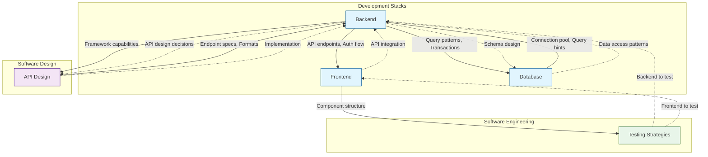

# Collaboration Network 視覺化

> Skills 之間的協作關係圖 - 基於 `collaboration` 區塊自動生成

## 網絡總覽



## 協作矩陣

| From → To | backend | frontend | database | api-design | testing |
|-----------|:-------:|:--------:|:--------:|:----------:|:-------:|
| **backend** | - | ✅ provides | ✅ delegates | ✅ delegates | - |
| **frontend** | ✅ receives | - | - | ✅ delegates | ✅ provides |
| **database** | ✅ receives/provides | - | - | ✅ delegates | - |
| **api-design** | ✅ provides/receives | ✅ provides | - | - | - |
| **testing** | ✅ receives/provides | ✅ receives/provides | - | - | - |

## 關係類型說明

### 1. Prerequisites（前置條件）

技能 A 依賴技能 B 作為基礎：

| Skill | Prerequisites | Reason |
|-------|---------------|--------|
| frontend | typescript | Type-safe component development |
| backend | typescript | Type-safe backend development |
| database | backend | Database used within backend context |

### 2. Delegation Triggers（委派觸發）

當遇到特定情況時，自動委派給其他技能：

| From | Trigger | Delegate To |
|------|---------|-------------|
| backend | API endpoint design decisions | api-design |
| backend | Database schema design | database |
| frontend | API integration | backend |
| api-design | Implementation of endpoints | backend |
| testing | Backend service to test | backend |

### 3. Context Passing（上下文傳遞）

技能之間傳遞的關鍵信息：

```
┌─────────────────────────────────────────────────────────────────┐
│  Context Flow Example                                           │
│                                                                 │
│  api-design ──────────────────────────────────► backend        │
│     │                                              │            │
│     │  Provides:                                   │            │
│     │  • Endpoint specifications                   │            │
│     │  • Request/response formats                  │  Provides: │
│     │  • Error code conventions                    │  • API     │
│     │                                              │    endpoints│
│                                                    ▼            │
│                                              frontend           │
└─────────────────────────────────────────────────────────────────┘
```

## 使用場景

### 場景 1: 全棧開發

當開發一個需要前後端的功能時：

```
推薦載入順序：
1. api-design    → 設計 API 規格
2. backend       → 實作後端邏輯
3. database      → 設計數據模型
4. frontend      → 實作前端介面
5. testing       → 編寫測試
```

### 場景 2: API 重構

當重構現有 API 時：

```
推薦載入順序：
1. api-design    → 評估當前設計
2. backend       → 了解實作約束
3. testing       → 確保不破壞現有測試
```

## 擴展建議

### 如何為新 Skill 添加 Collaboration

```yaml
# 在 SKILL.md frontmatter 中添加
collaboration:
  prerequisites:
    - skill: [依賴的技能]
      reason: [為什麼需要]

  delegation_triggers:
    - trigger: [觸發條件描述]
      delegate_to: [目標技能]
      context: [傳遞的上下文]

  receives_context_from:
    - skill: [來源技能]
      receives:
        - [接收的信息 1]
        - [接收的信息 2]

  provides_context_to:
    - skill: [目標技能]
      provides:
        - [提供的信息 1]
        - [提供的信息 2]
```

## 相關文件

- [COLLABORATION_FORMAT.md](COLLABORATION_FORMAT.md) - 格式規範
- [Sharp Edges](SHARP_EDGES_FORMAT.md) - 陷阱警告
- [Validations](VALIDATIONS_FORMAT.md) - 品質驗證
