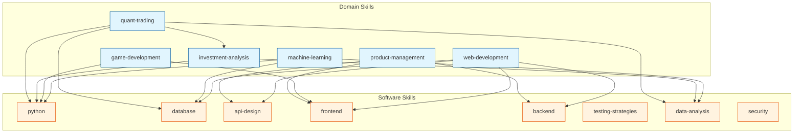
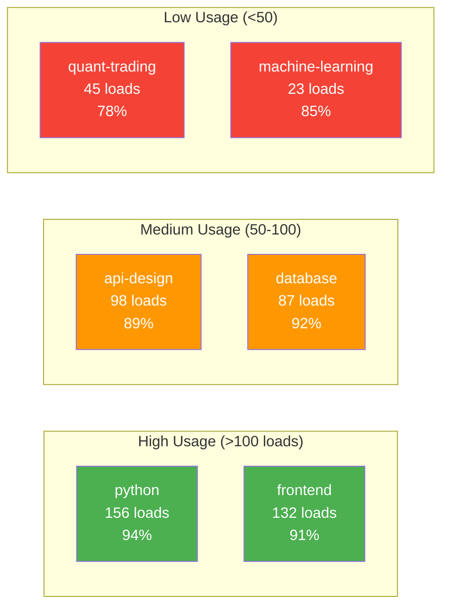
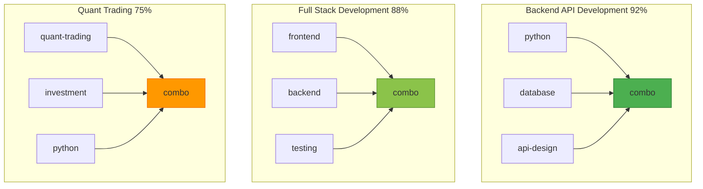
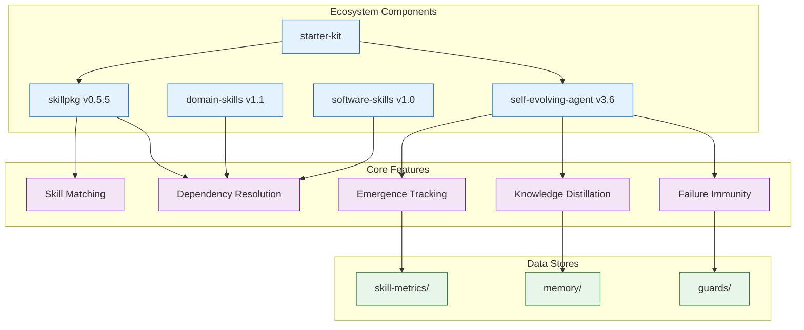

# 知識圖譜視覺化

> 將 Skill 依賴關係和使用模式視覺化

## 概述

知識圖譜視覺化將生態系統中的 Skills、Dependencies、使用模式呈現為互動式圖表。

## 圖譜類型

### 1. Skill 依賴圖 (Dependency Graph)

展示 Domain Skills 和 Software Skills 之間的依賴關係：



### 2. 使用熱度圖 (Usage Heatmap)

展示 Skills 的使用頻率和成功率：



### 3. 成功組合圖 (Successful Combinations)

展示驗證過的高成功率 Skill 組合：



## 資料結構

### 圖譜資料格式

```yaml
# knowledge-graph-data.yaml
---
nodes:
  - id: python
    type: software
    category: backend
    usage_count: 156
    success_rate: 0.94

  - id: quant-trading
    type: domain
    category: finance
    usage_count: 45
    success_rate: 0.78

edges:
  - from: quant-trading
    to: python
    type: dependency
    weight: 1.0

  - from: quant-trading
    to: database
    type: dependency
    weight: 0.8

combinations:
  - id: backend-api
    skills: [python, database, api-design]
    count: 34
    success_rate: 0.92
    verified: true
---
```

## CLI 命令（規劃）

```bash
# 生成 Mermaid 格式
npx claude-starter-kit graph --format mermaid > skill-graph.md

# 生成 DOT 格式 (Graphviz)
npx claude-starter-kit graph --format dot > skill-graph.dot

# 生成 JSON 格式
npx claude-starter-kit graph --format json > skill-graph.json

# 只顯示特定類型
npx claude-starter-kit graph --type dependencies
npx claude-starter-kit graph --type usage
npx claude-starter-kit graph --type combinations

# 互動式 Web 視覺化
npx claude-starter-kit graph --interactive
```

## 生成邏輯

```
┌─────────────────────────────────────────────────────────────────┐
│  知識圖譜生成流程                                               │
│                                                                 │
│  1. 收集節點資料                                                │
│     ├── 掃描 domain-skills/ 提取 skill 資訊                    │
│     ├── 掃描 software-skills/ 提取 skill 資訊                  │
│     └── 讀取 skill-metrics/statistics/ 取得使用統計            │
│                                                                 │
│  2. 建立邊（關係）                                              │
│     ├── 解析每個 skill 的 dependencies 欄位                    │
│     └── 從 skill-metrics/patterns/ 提取成功組合                │
│                                                                 │
│  3. 計算權重                                                    │
│     ├── 節點大小 = log(usage_count + 1)                        │
│     ├── 節點顏色 = success_rate 映射                           │
│     └── 邊粗細 = 共同使用次數                                  │
│                                                                 │
│  4. 輸出格式化                                                  │
│     ├── Mermaid: 適合 Markdown 嵌入                            │
│     ├── DOT: 適合 Graphviz 渲染                                │
│     ├── JSON: 適合 D3.js 互動式視覺化                          │
│     └── SVG: 靜態圖片輸出                                       │
└─────────────────────────────────────────────────────────────────┘
```

## 完整生態系統圖



## 互動式視覺化（規劃）

未來可使用 D3.js 建立互動式視覺化：

```javascript
// 互動功能
const features = {
  zoom: true,           // 縮放
  pan: true,            // 平移
  nodeClick: true,      // 點擊節點顯示詳情
  edgeHover: true,      // 滑過邊顯示關係
  filter: true,         // 過濾特定類型
  search: true,         // 搜尋節點
  export: ['svg', 'png'] // 匯出格式
};
```

## 相關

- [Ecosystem Health](ecosystem-health.md) - 健康報告
- [Dynamic Skill Recommendation](dynamic-skill-recommendation.md) - 動態推薦
- [Skill Metrics System](../.claude/memory/skill-metrics/README.md) - 涌現追蹤
